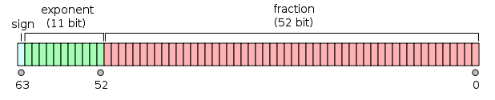

# 1.数据类型

Null, undefined, boolean, number, string, symbol, object

## 1.1 number

js以64位浮点数(IEEE754)的形式储存number



转换规则如下：
$$
6.5 = 110.1_2 = 1.101*2^4 = 1^0*(1+0.101)*2^{1025-1023}=(-1)^{sign}*(1+fraction)*2^{exponent-1023}
$$
所以$sign=0,exponent=1025=10000000001_2,fraction=1010000..000_2$

为什么是$exponent-1023$ ?

因为$2^{11} = 2048$表示范围为$[0,2047]$，而指数部分可能为负，所以使用$e-1023$表示范围转换为$[-1022,1023]$,其中$e \in (0,2047)$，因此js能表示的normal的范围为$[2^{-1022},2^{1023}]$

当$e == 0$ 

- $f!=0$，表示subnormal，即比$2^{-1022}$更小的正常数,计算方法为:

$$
{\displaystyle (-1)^{\text{sign}}\times 2^{1-1023}\times 0.{\text{fraction}}=(-1)^{\text{sign}}\times 2^{-1022}\times 0.{\text{fraction}}}
$$

- $f==0$,表示$0 ||-0$,符号表示趋向的方向

当$e==2047$时

- $f == 0$,表示*Infinity*和*-Infinity*
- $f!=0$表示*NaN*

## 1.2 null 和 undefined

undefined 在一个变量声明且未赋值时由编译器自动赋值，null需要手动赋值

```javascript
null == undefined//true
null === undefined//false
typeof(null)//object
typeof(undefined)//undefined
```

- 安全整数
- Truthy and falsy and ! and !!(非boolean的强制转换)bool逻辑
- set, map, weakset, weakmap
- memory model && leak